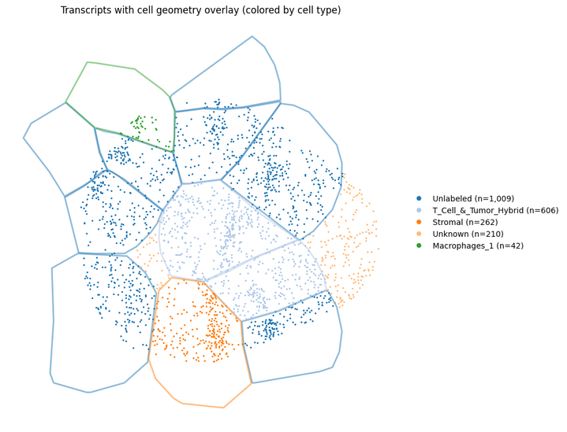
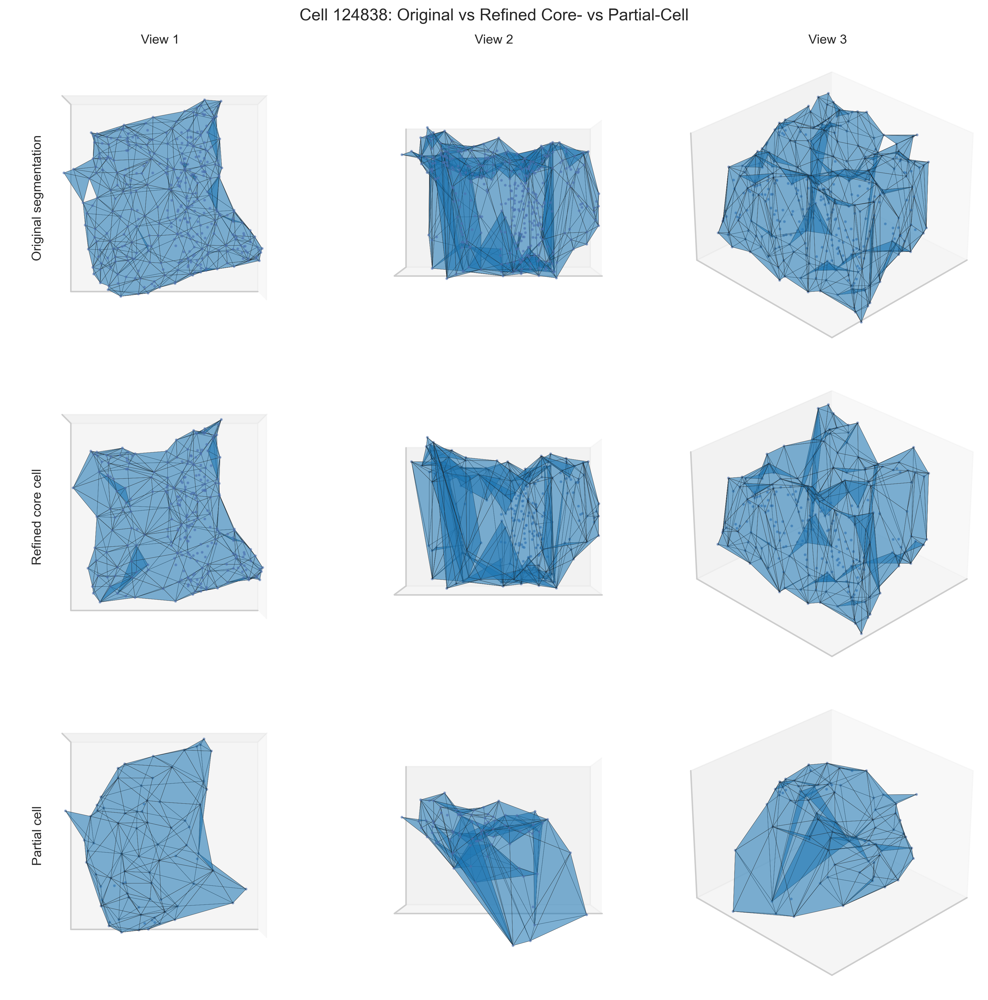
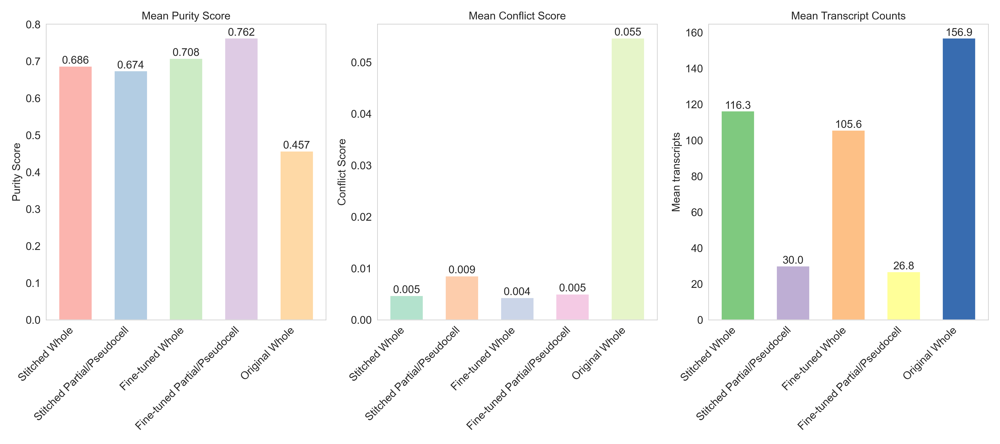
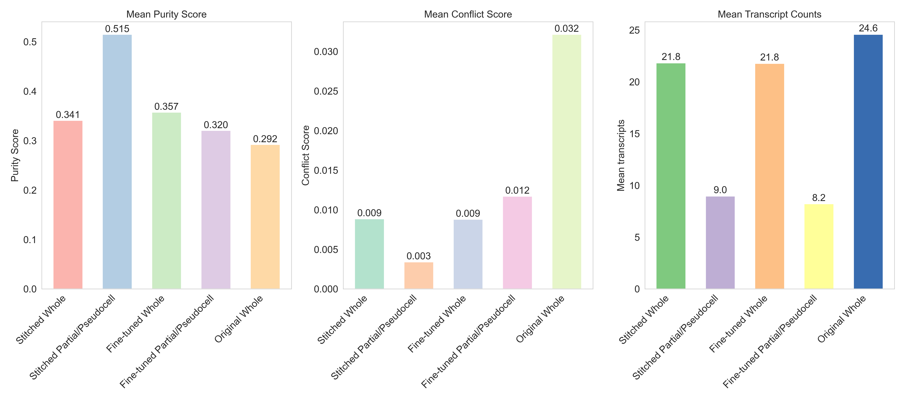

# TRACER (HOT-NERD)

<p align="center">
  
</p>
Tissue Reconstruction via Associative Clique Extraction and Relation-mapping (TRACER)
(internally developed as HOT-NERD — High-Order Transcriptomic with NPMI-Enhanced Reconstruction & Delaunay-stitching)

Overview
--------
TRACER is a Python package for imaging-based spatial transcriptomics, enabling 3D tissue reconstruction, segmentation refinement, and partial pseudo-cell inference.

The software is implemented and distributed under the internal package name HOT-NERD, which reflects the underlying high-order transcriptomic reconstruction methodology.

- Partition large tissue spatially using Metis on a kNN graph built from cell centroids.
- Compute gene co-occurrence statistics (PMI / NPMI) and derive per-cell purity and conflict metrics.
- Utilities to refine cell segmentation using a 3D transcript graph and identify 3D partial (pseudo) cells.

Quick start
-----------
Install the package (editable for development):

```bash
python3 -m pip install -e '.[dev]'
```

Cython acceleration (Recommended)
------------------------------
HOT-NERD ships a Cython module to accelerate greedy NPMI pruning. To build and install a wheel that compiles the Cython extension, ensure you have a C compiler and `Cython` available.

macOS prerequisites:

- Install Xcode command line tools if not already present:

```bash
xcode-select --install
```

- Install build tools and Cython in your Python environment:

```bash
python -m pip install --upgrade pip build wheel setuptools Cython
```

Build a wheel (recommended for reproducible builds):

```bash
python -m build --wheel --no-isolation -o dist
# or: python -m pip wheel . -w dist
```

Install the built wheel:

```bash
python -m pip install dist/hotnerd-*.whl
```

Editable / development install (dynamic compilation fallback):

If you prefer editable installs during development, you can still use the pyximport fallback which will attempt to compile the `.pyx` at import time when `Cython` is present:

```bash
python -m pip install -e '.[dev]'
# Make sure Cython is installed in the same environment so pyximport can compile on-demand
python -m pip install Cython
```

Notes:

- Building wheels is recommended for reproducible, faster imports (no on-the-fly compilation).
- If a wheel is not available or Cython isn't installed, HOT-NERD falls back to pure-Python implementations (behaviorally identical, slower).

Import and inspect available functions:

```python
import hotnerd
print(hotnerd.__version__)
print(sorted(hotnerd.__all__))
```

Example
-------
The `examples/` and `tutorials/` folders contain runnable demonstrations that show how HOT-NERD can refine an initial segmentation produced by the 10X Xenium platform.

### Breast Cancer Example (3D Refinement)

- Original segmentation (10X Xenium V1, breast cancer):



- After refining segmentation with HOT-NERD, we can identify Z-axis overlap at single-cell level:



Run the example locally:

```bash
pip install -e .
python examples/refine_segmentation.py
```

### Breast Cancer Tutorial (Large-Scale 3D Refinement & Quality Metrics)

HOT-NERD demonstrates exceptional performance on a large-scale Xenium v1 breast cancer dataset (~28M transcripts) with dramatic quality improvements:



**Quantitative Improvements on Standard Xenium Segmentation:**
- **Purity Score** (gene co-expression consistency): 0.457 → 0.686 (HOT-NERD Stitched) → **0.708** (HOT-NERD Stitched + Fine-tuned) — **+55% improvement**
- **Conflict Score** (incompatible gene signatures): 0.055 → 0.005 (HOT-NERD Stitched) → **0.004** (HOT-NERD Stitched + Fine-tuned) — **-93% reduction**

**Enhanced Cell Type Clustering with Author-Annotated Cell Types:**

The refined segmentation produces significantly improved UMAP embeddings with clear lineage separation and enhanced within-cell-type cohesion:


See the [breast cancer tutorial](tutorials/breast_cancer/) for complete analysis details.

### Lung Cancer Tutorial (Quality Metrics & UMAP Enhancement)

HOT-NERD significantly improves cell segmentation quality, as demonstrated on a lung cancer biopsy sample using NPMI-based purity and conflict scores:



**Quantitative Improvements:**
- **Purity Score** (gene co-expression consistency): 0.292 → 0.356 (HOT-NERD Stitched) → **0.373** (HOT-NERD Stitched + Fine-tuned) — **+28% improvement**
- **Conflict Score** (incompatible gene signatures): 0.032 → 0.009 (HOT-NERD Stitched) → **0.008** (HOT-NERD Stitched + Fine-tuned) — **-75% reduction**

**Enhanced UMAP Interpretability:**

The improved segmentation quality translates to clearer, more biologically interpretable UMAP embeddings with better-defined cell clusters:


See the [lung cancer tutorial](tutorials/lung_cancer/) for detailed analysis.

Design notes
------------
- Source layout: `src/` package layout.
- Runtime dependencies include `numpy`, `pandas`, `geopandas`, `shapely`, `scikit-learn`, `pymetis`, `open3d`, and `matplotlib`.

Contact
-------
For questions or collaboration, please contact:
- Long Yuan — lyuan13[at]jhmi.edu
- Atul Deshpande — adeshpande[at]jhu.edu

Repository
----------
https://github.com/imlong4real/HOT-NERD

License
-------
Apache License 2.0 (see LICENSE)


