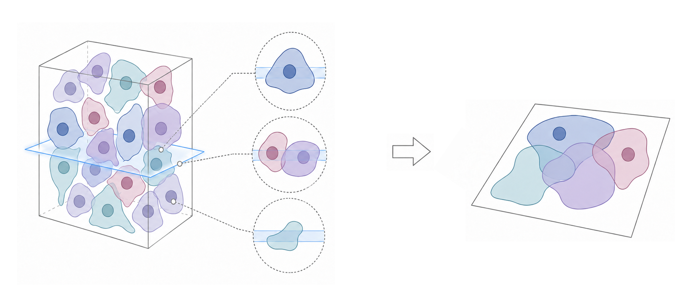
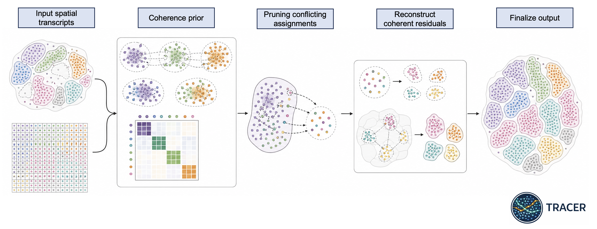

<h1 align="center">TRACER</h1>
<p align="center"><b>Reconstructing biologically coherent cellular profiles from spatial transcriptomics</b></p>

<!-- badges: start -->
<p align="center">

[](https://github.com/imlong4real/TRACER/actions/workflows/test.yml)
[](https://github.com/imlong4real/TRACER/actions/workflows/build-docker.yml)
[](LICENSE)
[](https://www.biorxiv.org/content/10.64898/2026.03.08.710395v1)
[](https://www.iscb.org/ismb2026/whats-happening/track-details)
[](https://www.youtube.com/watch?v=CugrfP88tAk)

</p>
<!-- badges: end -->

TRACER is a **reference-optional framework for refining mixed spatial transcriptomic
profiles and reconstructing coherent anuclear or partial cells** from imaging- and
sequencing-based spatial transcriptomics. It learns a gene–gene coherence prior from
the data itself (or, optionally, a single-cell reference), prunes conflicting transcript
assignments, and rebuilds biologically consistent whole and partial cells.

---

## Why TRACER?

Modern spatial assays localize transcripts with high accuracy, yet the *cellular
profiles* derived from them are often **mixed, incomplete, or missing**. Tissue
thickness and 3D overlap blend neighboring cells; nuclear-anchored segmentation drops
anuclear fragments; rigid binning splits cells across bins; and segmentation errors
leak transcripts across boundaries. The result is a cell-by-gene matrix that
misrepresents the underlying biology.

<p align="center">
  
</p>

TRACER targets these failure modes directly — recovering coherent profiles without
requiring a matched reference atlas.

## How TRACER works

TRACER scores transcript-to-cell assignments against a learned gene–gene coherence
prior, removes conflicting transcripts, and reconstructs residual/partial cells from
the leftover signal — preserving the input segmentation where it is trustworthy.

<p align="center">
  
</p>

## Features

- **Segmentation-mode refinement** — correct and clean profiles starting from existing cell masks.
- **No-segmentation reconstruction** — rebuild profiles from bins or local transcript neighborhoods (e.g. VisiumHD-style binned data).
- **Coherence-prior learning** — derive a PMI/NPMI gene–gene prior from the dataset itself, or optionally from a single-cell reference.
- **Conflict pruning** — demote transcripts whose genes are incompatible with the rest of their assigned cell.
- **Partial-cell reconstruction** — assemble coherent residual/partial cells from pruned and unassigned transcripts.
- **Broad input support** — designed for imaging-based platforms (Xenium, Xenium 5K, CosMx, MERFISH) via a standardized transcript table, and for VisiumHD-style binned data via the no-segmentation pipeline.
- **Laptop-friendly** — Cython-accelerated kernels keep typical ROIs runnable on CPU.

## Installation

Requires Python ≥ 3.9 and a C compiler (TRACER ships Cython extensions).

```bash
# development install (editable, with dev/test extras)
pip install -e ".[dev]"

# plain local install
pip install .
```

> PyPI release: _coming soon._

**Cython notes.** The extensions (`_cy_*.pyx`) compile automatically during install,
so a C toolchain must be present. On macOS, install the command-line tools first
(`xcode-select --install`). For a reproducible, faster-importing build you can build a
wheel instead: `python -m build --wheel` then `pip install dist/tracer-*.whl`.

Run the test suite:

```bash
python -m pytest
```

## Quick start

TRACER consumes a **standardized transcript table** plus a **gene–gene NPMI panel**
(both produced by the helper scripts in `scripts/`).

**Segmentation mode** — refine an existing segmentation:

```bash
python scripts/run_tracer.py \
  --transcripts transcripts.parquet \
  --npmi        npmi_panel.csv.gz \
  --platform    xenium \
  --outdir      results/tracer_seg \
  --sample-name my_sample \
  --seed 1
```

**No-segmentation mode** — reconstruct profiles from VisiumHD-style bins:

```bash
python -m tracer.noseg_pipeline \
  --visiumhd-matrix path/to/binned_outputs/square_002um/filtered_feature_bc_matrix \
  --spatial-dir     path/to/binned_outputs/square_002um/spatial \
  --npmi            npmi_panel.csv.gz \
  --platform-config src/tracer/configs/platforms/noseg.toml \
  --outdir          results/tracer_noseg \
  --sample-name     my_visiumhd_sample \
  --bin-size-um 2 --seed 1
```

See the available options with `python scripts/run_tracer.py --help`. Add `--smoke`
to the no-segmentation run for a fast ROI-limited end-to-end check.

## Inputs

- **Transcript table** (`--transcripts`, Parquet): one row per transcript with
  spatial coordinates (`x`, `y`, and `z` for 3D; `z` is synthesized for 2D data),
  a gene name (`feature_name`), an initial segmentation label (`cell_id`; unassigned
  transcripts are allowed), and a `transcript_id`. An optional `overlaps_nucleus`
  flag enables nuclear-aware steps. Standardize raw vendor exports with
  `scripts/preprocess_xenium.py`.
- **NPMI panel** (`--npmi`, CSV/CSV.gz): long-format gene–gene co-occurrence statistics
  (`gene_i`, `gene_j`, `PMI`, `NPMI`), built with `scripts/build_npmi_from_scrna.py`
  from the dataset or a single-cell reference.
- **No-segmentation mode** additionally takes a VisiumHD feature–barcode matrix and its
  `spatial/` directory in place of a transcript table.

## Outputs

Written under `--outdir/outputs/`:

- **`transcripts_tracer_refined.parquet`** — per-transcript fate table: final entity
  label (`stitched`/`tracer_id`), entity type `_etype` (`cell` = refined whole cell,
  `partial` = reconstructed partial/residual cell, `unknown` = unassigned), and the
  original `cell_id` for reassignment auditing.
- **`cell_by_gene_tracer.h5ad`** — reconstructed cell-by-gene matrix over refined whole
  cells and reconstructed partial cells.
- **`cell_scores.tsv.gz`** — per-cell QC: purity and conflict (coherence) metrics.

Each run also records `run_summary.md` (stage-by-stage cell/partial/unassigned counts),
`config_receipt.json` (exact resolved config), and `runtime_memory.json`.

## Citation

If you use TRACER, please cite:

> **Reconstructing biologically coherent cellular profiles from imaging-based spatial transcriptomics**
> Long Yuan, Youyun Zheng, Shuming Zhang, Rameen Beroukhim, Atul Deshpande.
> bioRxiv (2026). DOI: [10.64898/2026.03.08.710395](https://doi.org/10.64898/2026.03.08.710395)

## Contact

For questions or collaboration:

- Long Yuan — `lyuan13[at]jhmi.edu`
- Atul Deshpande — `adeshpande[at]jhu.edu`

## License

Apache License 2.0 — see [LICENSE](LICENSE).
